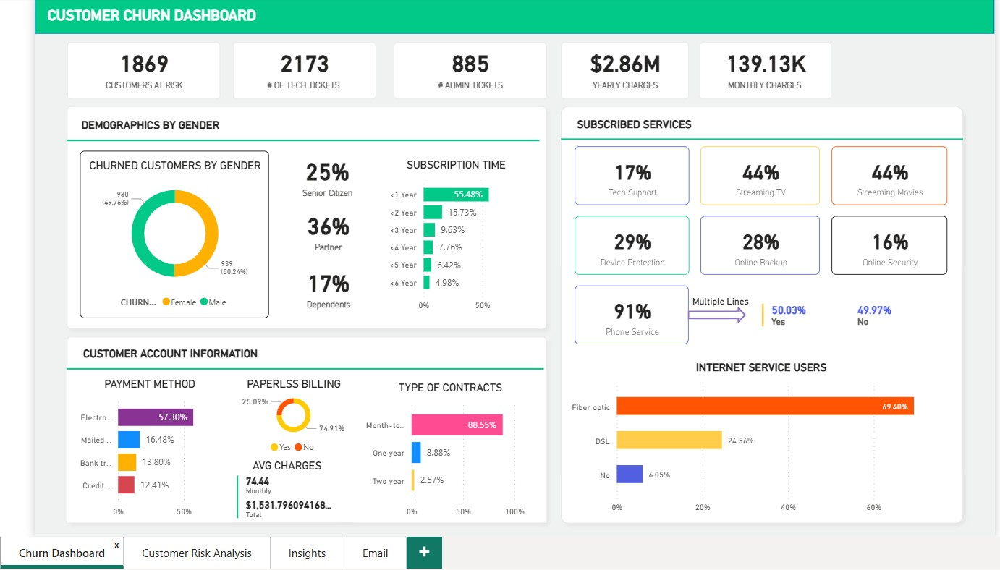

Customer Churn Dashboard

This project analyzes telecom customer churn using Power BI.

Objectives
- Identify customers likely to churn
- Analyze churn by contract type
- Understand churn by payment method

Tools Used
- Power BI
- Excel
- Data Analysis

Insights
- Month-to-month contracts show highest churn
- Electronic check users churn more frequently
- Senior citizens show higher churn rate
## Dashboard Preview

